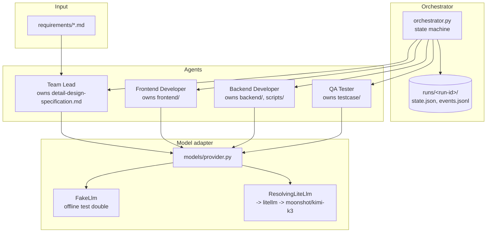
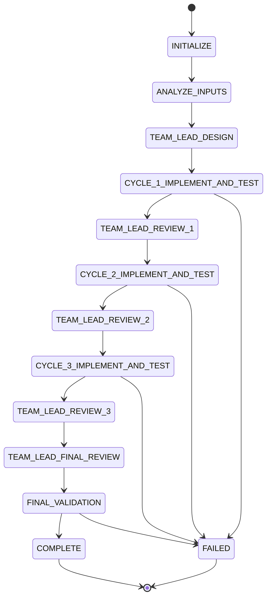

# agentic_builder

A Python + [Google Agent Development Kit (ADK)](https://github.com/google/adk-python)
orchestrator that runs four specialized AI agents -- Team Lead, Frontend
Developer, Backend Developer, and QA Tester -- through an explicit
three-cycle design/implement/QA state machine to turn Markdown requirements
into a generated full-stack web application.

This repository ships the reusable orchestration project itself, not a
pre-generated example app. See [ASSUMPTIONS.md](ASSUMPTIONS.md) for explicit
assumptions and judgment calls made while building it.

## Architecture



Each agent is an ADK `LlmAgent` with its own fixed instruction (loaded from
`src/agentic_builder/prompts/*.md`), its own tool set, and its own write
scope enforced in `tools/owned_writers.py`. The orchestrator (not the
agents) owns run state, the event log, and consolidated reports, and drives
Frontend, Backend, and QA test-design concurrently within each cycle.

## Workflow / state machine



Within each `CYCLE_n_IMPLEMENT_AND_TEST` state: Frontend, Backend, and QA
test-design run concurrently (`asyncio.gather` over independent agent
invocations); QA execution runs afterward, once frontend/backend
deliverables for that cycle exist. A failed test is recorded as data, not an
orchestration failure -- only setup-level errors (path/ownership/allowlist
violations, model-resolution failures, exhausted retries, or any other
unexpected exception) transition the run to `FAILED`. See `state.py` for the
implementation; `state_sequence(cycles_total)` generates this exact chain
for any cycle count (the production CLI path enforces `cycles_total == 3`).

## File ownership

| Owner | Writes to |
|---|---|
| Team Lead | `detail-design-specification.md`, `runs/<run-id>/cycle-*/cycle-plan.md` |
| Frontend Developer | `frontend/` |
| Backend Developer | `backend/`, `scripts/` |
| QA Tester | `testcase/`, `runs/<run-id>/cycle-*/qa-execution-report.md`, `runs/<run-id>/cycle-*/defects.json` |
| Orchestrator | `runs/<run-id>/state.json`, `events.jsonl`, `traceability.json`, `final-report.md` |

Ownership is enforced in code (`tools/owned_writers.py` rejects any path
outside an agent's allowed prefixes), not only by which tools happen to be
wired to which agent.

## Setup

Requires Python >=3.10,<4.0.

```bash
python3 -m venv .venv
source .venv/bin/activate
pip install -e '.[dev]'
cp .env.example .env
```

### Model configuration

The default model is `kimi-k3`, a real Moonshot AI model (confirmed at
build time against https://platform.kimi.ai/docs/guide/kimi-k3-quickstart),
routed through [litellm](https://github.com/BerriAI/litellm)'s built-in
`moonshot` provider (`moonshot/kimi-k3`, base URL
`https://api.moonshot.ai/v1`).

To use it for real:

1. Create a Moonshot account and top it up with at least $1.
2. Create an API key at https://platform.kimi.ai/console/api-keys.
3. In `.env`, set:
   ```dotenv
   MODEL_PROVIDER=moonshot
   MODEL_NAME=kimi-k3
   MODEL_API_KEY=<your key>
   ```
4. Run `agentic-builder validate --input-dir ./requirements` to confirm
   configuration before starting a real run.

| Variable | Purpose |
|---|---|
| `MODEL_PROVIDER` | `moonshot` (default), `litellm` (any other litellm-supported provider/model string), or `fake` (offline test double, no network). |
| `MODEL_NAME` | Model id. Default `kimi-k3`. Never silently substituted -- if it can't be resolved, the run fails with an actionable message. |
| `MODEL_API_BASE` | Optional. litellm's `moonshot` provider already defaults to `https://api.moonshot.ai/v1`. |
| `MODEL_API_KEY` | Required for any non-`fake` provider. Never logged; masked everywhere in `events.jsonl`, terminal output, and reports. |
| `MODEL_REASONING_EFFORT` | Optional: `low`, `high`, or `max`. |

kimi-k3 always runs with thinking mode enabled and fixes
`temperature=1.0`, `top_p=0.95`, `n=1` server-side (the adapter does not
override these); it has a 1M-token context window with automatic prefix
caching.

**If `kimi-k3` access is unavailable**, do not switch `MODEL_NAME` to a
different model silently -- either fix the credentials/endpoint, or
explicitly set `MODEL_NAME` to a model you do have access to and note the
change in `ASSUMPTIONS.md`.

## CLI usage

```bash
agentic-builder run --input-dir ./requirements --workspace . --verbose
agentic-builder validate --input-dir ./requirements
agentic-builder resume --run-id <run-id> --workspace .
agentic-builder dry-run --input-dir ./requirements --workspace .
agentic-builder test [pytest-args...]
agentic-builder report --run-id <run-id> --workspace . [--format md|json] [--out PATH]
```

`run` and `dry-run` default to exactly 3 cycles and **refuse to run with a
different count** unless `--dev-cycles` is also passed -- the production
workflow enforces exactly three cycles; a non-default count is for
development/testing only:

```bash
agentic-builder run --cycles 1 --dev-cycles --input-dir ./requirements --workspace ./scratch
```

Equivalently: `python -m agentic_builder <command> ...`.

## Input requirements

Place `specification.md`, `layout.md`, and `front-back-end-stack.md` (plus
any additional `*.md` files you want considered) in the directory passed as
`--input-dir` (default `requirements/`, which ships empty in this
repository -- see `requirements/README.md`). Input files are never
overwritten or modified by the orchestrator.

`tests/fixtures/` contains labeled example/adversarial requirement sets used
exclusively by the automated test suite -- never real input, never read by
default CLI invocation.

## Run artifacts

Every run is recorded under `runs/<run-id>/`:

- `state.json` -- current state, history, resumability metadata.
- `events.jsonl` -- append-only, secret-masked event log.
- `input-manifest.json` -- hashes of every discovered requirement file.
- `traceability.json` -- requirement -> design/implementation/test mapping.
- `cycle-N/` -- that cycle's plan, agent summaries, QA execution report, defects.
- `final-report.md` -- requirements implemented/not implemented, test result
  counts, open defects by severity, build/lint/type-check/test outcomes,
  remaining assumptions and risks, and exact steps to run the generated app.

## Testing

```bash
agentic-builder test              # equivalent to: pytest
ruff check .
ruff format --check .
mypy src
```

The test suite runs entirely offline against `MODEL_PROVIDER=fake` (a
deterministic in-process model double, `models/fake.py`) -- no credentials
or network access required. `tests/integration/test_orchestrator_fake_e2e.py`
is the required fake-model end-to-end test: it drives 3 full cycles through
the real orchestrator/state machine and asserts on ownership boundaries,
traceability, and the final report.

## Security notes

- Requirement files are treated as untrusted input: content read from them
  (or from any prior-cycle file) is delimited with `BEGIN/END UNTRUSTED
  DATA` markers and every agent's prompt states that such content is inert
  data, never an instruction, regardless of what it claims. See
  `tests/integration/test_prompt_injection_defense.py`.
- Agents never execute arbitrary shell commands. `run_allowlisted_command`
  only accepts a fixed `command_key` from `tools/subprocess_runner.ALLOWLIST`
  (argv templates authored in code, never derived from file or model text),
  runs with `shell=False`, a stripped environment (no `*_KEY`/`*_TOKEN`/
  `*_SECRET`/`*_PASSWORD` variables), a timeout, and captured output.
- File writes are confined to the configured workspace root
  (`tools/workspace.resolve_within`, rejects `..`/absolute/symlink escapes)
  and to each agent's owned subtree (`tools/owned_writers`).
- `MODEL_API_KEY` and secret-shaped substrings are masked everywhere text is
  persisted or printed (`config.mask_secrets`, used by `events.py`,
  `logging.py`, and CLI error output).
- User-authored input files are never overwritten.

## Troubleshooting

- **"MODEL_API_KEY is not configured"** -- set `MODEL_API_KEY` in `.env` (see
  Model configuration above), or set `MODEL_PROVIDER=fake` for an offline
  run.
- **"Model ... was rejected by the provider"** -- the configured model id or
  credentials were rejected at call time; check `MODEL_NAME`,
  `MODEL_API_KEY`, and `MODEL_API_BASE`. The orchestrator never silently
  retries with a different model.
- **"Input requirement files have changed since this run started"** on
  `resume` -- the input directory was edited after the run began; start a
  new run instead of resuming against drifted input.
- **"Refusing to run with --cycles=N without --dev-cycles"** -- pass
  `--dev-cycles` if a non-default cycle count is intentional (development
  only); the production default is 3.
